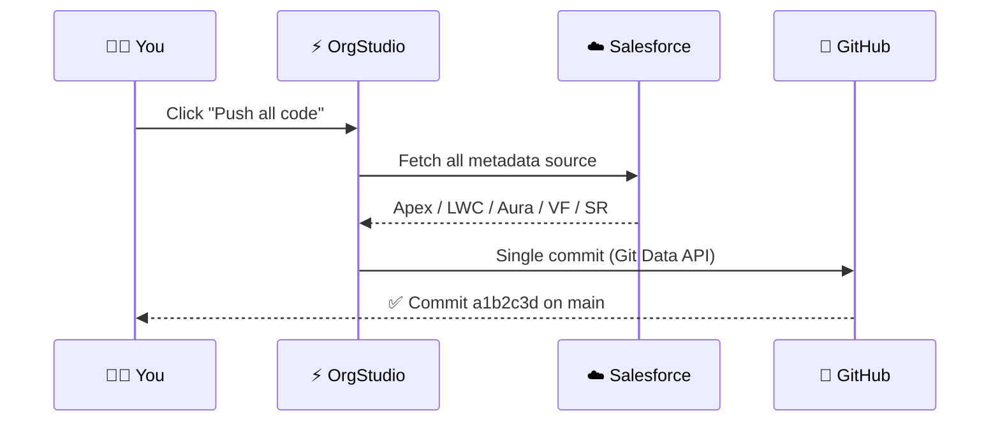

<div align="center">


# ⚡ Salesforce OrgStudio — IDE + Inspector

### 🚀 A full Salesforce IDE **inside your browser** — merged with the complete Salesforce Inspector toolset and one‑click **GitHub** version control.

<p>
  
  
  
  
  
  
</p>

<p>
  <a href="#-features">Features</a> •
  <a href="#-installation">Install</a> •
  <a href="#-quick-start">Quick Start</a> •
  <a href="#-the-toolset">Toolset</a> •
  <a href="#-github-version-control">GitHub</a> •
  <a href="#-privacy">Privacy</a> •
  <a href="#-faq">FAQ</a>
</p>

</div>

---

<div align="center">

```
   ╔══════════════════════════════════════════════════════════════╗
   ║   Browse • Edit • Deploy • Query • Import • Inspect • Sync    ║
   ║        …all against the org you're already logged into.       ║
   ╚══════════════════════════════════════════════════════════════╝
```

</div>

## ✨ Why OrgStudio?

> 🧩 **Three tools in one.** A VS Code‑style **IDE**, the full **Salesforce Inspector** suite, and **GitHub** version control — unified behind a single session. No separate logins, no context‑switching, no servers.

<table>
<tr>
<td width="33%" align="center">

### 🖥️ IDE
Edit & deploy Apex, LWC, Aura, VF & Static Resources with syntax highlighting.

</td>
<td width="33%" align="center">

### 🔎 Inspector
SOQL Export, Data Import & Show All Data — pixel‑for‑pixel functionality.

</td>
<td width="33%" align="center">

### 🐙 GitHub
One‑click **pull / push / commit** of all your code to a repo & branch.

</td>
</tr>
</table>

---

## 🎯 Features

### 🖥️ In‑Browser IDE
| | Feature | Description |
|:--:|:--|:--|
| 🗂️ | **Metadata Explorer** | Apex Classes & Triggers, LWC, Aura, Visualforce, Static Resources |
| ✍️ | **Code Editor** | Syntax highlighting, find & replace, bracket matching, aligned gutter |
| 🚀 | **Save / Deploy** | One keystroke (`Ctrl/Cmd + S`) via Tooling & Metadata APIs |
| ➕ | **Create & Upload** | New components or upload files & LWC folders |
| 🧪 | **Dev Tools** | Anonymous Apex, tests + coverage, debug logs |
| 🔍 | **Explorers** | Code Finder, REST & GraphQL explorers, Package Manager |

### 🔎 Salesforce Inspector Tools
| | Tool | Highlights |
|:--:|:--|:--|
| 📤 | **SOQL Export** | Context‑aware autocomplete (objects, fields, **dot‑notation** relationships), relationship‑flattened columns (`Account.Name`), History, Favorites, Copy/Download to Excel · CSV · JSON |
| 📥 | **Data Import** | Insert / Update / Upsert / Delete / Undelete, field mapping, batching & threads, live **Queued / Processing / Succeeded / Failed** progress |
| 📋 | **Show All Data** | Full field‑level record view; double‑click to edit picklist & boolean fields |

### 🐙 GitHub Version Control
| | Action | What it does |
|:--:|:--|:--|
| ⬆️ | **Push active file** | Commit the file open in the editor |
| 📦 | **Push all code** | Commit **every** component in a single commit |
| ⬇️ | **Pull from repo** | Browse repo files and open them in the editor |

---

## 📦 Installation

<div align="center">


</div>

```bash
# 1️⃣  Clone the repo
git clone https://github.com/<your-username>/salesforce-orgstudio.git

# 2️⃣  Open Chrome/Edge → chrome://extensions
# 3️⃣  Toggle "Developer mode" (top-right)
# 4️⃣  Click "Load unpacked" → select the extension folder
# 5️⃣  Pin the OrgStudio icon 📌 — you're done!
```

---

## ⚡ Quick Start

<table>
<tr><td>

**1.** 🔐 Log into your Salesforce org in a browser tab
**2.** 🖱️ Click the **OrgStudio** icon → **“Connect to your open org”**
**3.** 🌳 Browse metadata in the sidebar → open a file → edit
**4.** 💾 Press `Ctrl/Cmd + S` to deploy
**5.** 🐙 *(Optional)* Click the **GitHub** button to enable version control

</td></tr>
</table>

> [!TIP]
> Use **`Ctrl/Cmd + Enter`** in the editor to run **Anonymous Apex**, and **`Ctrl/Cmd + F`** to find within a file.

---

## 🧰 The Toolset

<details>
<summary><b>📤 SOQL Export — click to expand</b></summary>

<br>

- 🧠 **Smart autocomplete** — after `FROM` suggests sObjects; in the field list suggests fields, relationships & keywords
- 🔗 **Dot‑notation traversal** — type `Account.` to drill into the parent object (multi‑hop: `Owner.Manager.Name`)
- 🧾 **Inspector‑style output** — parent fields flatten to dotted columns; child sub‑queries show as `[N rows]`
- ⭐ **History & Favorites**, 🧹 **Format Query**, 📃 **Query‑all pages**
- 📋 **Copy / Download** → Excel · CSV · JSON

```sql
SELECT Id, Name, Account.Name, Owner.Alias
FROM   Contact
WHERE  Account.Industry = 'Technology'
```

</details>

<details>
<summary><b>📥 Data Import — click to expand</b></summary>

<br>

- 🔀 Insert / Update / **Upsert** / Delete / Undelete
- 🧭 Object auto‑detection & external‑ID support
- 🗺️ Visual **field mapping**
- ⚙️ Configurable **batch size** & **threads**
- 📊 Live counters + progress bar

</details>

<details>
<summary><b>📋 Show All Data — click to expand</b></summary>

<br>

- 🔬 Full field‑level record view
- ✏️ Double‑click to edit (picklist & boolean aware)
- 🆔 Id hover actions → Show all data · View in Salesforce · Copy Id

</details>

---

## 🐙 GitHub Version Control

<div align="center">



</div>

> [!NOTE]
> Your **Personal Access Token** is stored **locally** and sent only to `api.github.com`. Prefer a **fine‑grained token** scoped to a single repo.

---

## ⌨️ Keyboard Shortcuts

| Shortcut | Action |
|:--:|:--|
| `Ctrl/Cmd + S` | 💾 Save / Deploy active file |
| `Ctrl/Cmd + F` | 🔍 Find in file |
| `Ctrl/Cmd + Enter` | ⚡ Run Anonymous Apex |

---

## 🛡️ Privacy

<div align="center">

| 🚫 No Analytics | 🚫 No Tracking | 🚫 No Ads | 🚫 No Servers |
|:--:|:--:|:--:|:--:|

</div>

- 🔒 Session/OAuth tokens, GitHub token & preferences **stay on your device**
- 🌐 Talks **only** to *your* Salesforce org and *(optionally)* *your* GitHub repo
- 🧾 Full policy → **[`privacy-policy.html`](./privacy-policy.html)**

---

## 🧱 Tech Stack

<div align="center">


</div>

- ⚙️ **Manifest V3** service worker · zero remote code
- 🧩 Vanilla JS modules (no framework, no build step)
- 🎨 Custom themed UI with light/dark modes

---

## ❓ FAQ

<details>
<summary><b>Do I need a Connected App to log in?</b></summary>
<br>
Nope! OrgStudio reuses your existing Salesforce session in one click. OAuth (PKCE) is available as an optional method.
</details>

<details>
<summary><b>Does it work with sandboxes?</b></summary>
<br>
Yes — production, sandbox, and My Domain orgs are all supported.
</details>

<details>
<summary><b>Is my data sent anywhere?</b></summary>
<br>
Only to your own Salesforce org and (optionally) your own GitHub repo. Never to the developer — there are no servers.
</details>

---

## 🗺️ Roadmap

- [x] 🖥️ In‑browser IDE with deploy
- [x] 🔎 Salesforce Inspector tools
- [x] 🐙 GitHub one‑click version control
- [ ] 🌈 Additional editor themes
- [ ] 🔁 Diff view before push
- [ ] 🧪 Inline test‑coverage gutters

---

## 🤝 Contributing

Contributions, issues, and feature requests are welcome! 🎉
Feel free to check the [issues page](../../issues).

```bash
# Fork → create a branch → commit → open a PR 🚀
git checkout -b feature/amazing-thing
git commit -m "✨ Add amazing thing"
git push origin feature/amazing-thing
```

---

## 👤 Author

<div align="center">

**Subhrajyoti Sadhu**
*Salesforce Developer & Consultant*

[](https://www.linkedin.com/in/subhrajyoti-sadhu/)
[](https://www.salesforce.com/trailblazer/subhrajyoti-sadhu)

</div>

---

## 📜 License

<div align="center">

Released under the **MIT License** — see [`LICENSE`](./LICENSE).

<br>

⚠️ *Not affiliated with, endorsed by, or sponsored by Salesforce, Inc. or GitHub, Inc.*
*“Salesforce” and “GitHub” are trademarks of their respective owners.*

<br>

### ⭐ If OrgStudio saves you time, consider starring the repo!


</div>
